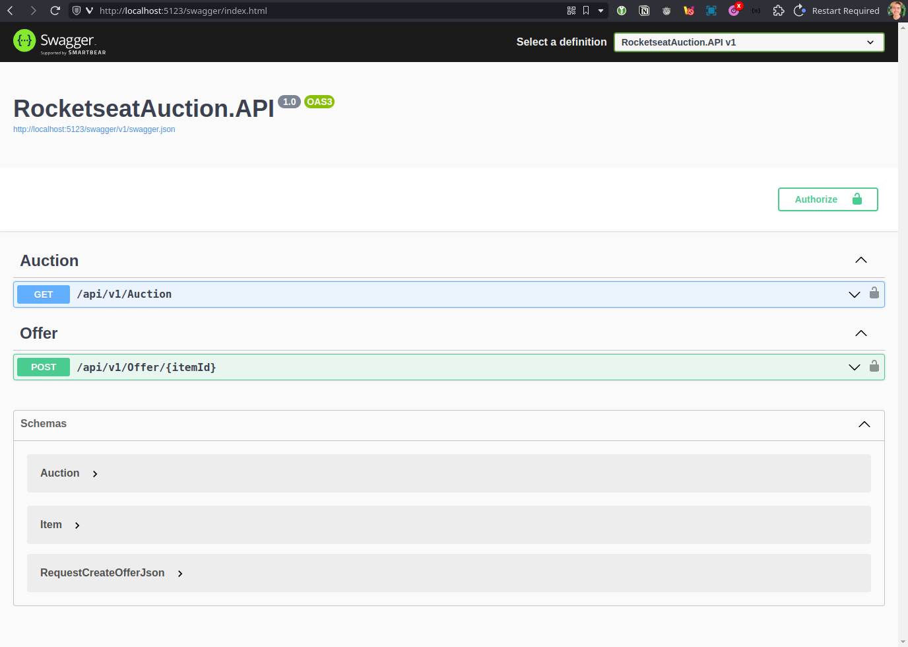

<section align="center">

  

   
   

  <!-- badges -->

  

    <a href="#about">About</a> •
    <a href="#technologies">Technologies</a> •
    <a href="#getting-started">Getting Started</a> •
    <a href="#contribution">Contribution</a> •
    <a href="#license">License</a>
  

</section>

---

<h2 id="about">💬 About</h2>

This project was developed during the [NLW#14 Expert]() event offered by [Rocketseat](). The solution developed is a [simple](/// "very very simple") API of an auction system with the following features:

- Get data from open auctions;
- Perform an offer to a specific item in a specific auction;

My main goal to participate in the event was to start my contact with language and the development process with it.

> Figure 1: Swagger documentation.
> 

<h2 id="technologies"> 🛠️ Technologies</h2>

- [.NET](https://dotnet.microsoft.com)
- [VSCode](https://code.visualstudio.com)
- VSCode Plugin
  - [Base language support for C#](https://marketplace.visualstudio.com/items?itemName=ms-dotnettools.csharp)

#### RocketseatAuction.API dependencies

| Top-level Package                    | Requested | Resolved |
| ------------------------------------ | --------- | -------- |
| Microsoft.EntityFrameworkCore        | 8.0.1     | 8.0.1    |
| Microsoft.EntityFrameworkCore.Sqlite | 8.0.1     | 8.0.1    |
| Swashbuckle.AspNetCore               | 6.4.0     | 6.4.0    |

#### UseCases.Test dependencies

| Top-level Package                 | Requested | Resolved |
| --------------------------------- | --------- | -------- |
| Bogus                             | 35.4.0    | 35.4.0   |
| coverlet.collector                | 6.0.0     | 6.0.0    |
| FluentAssertions                  | 6.12.0    | 6.12.0   |
| Microsoft.NET.Test.Sdk            | 17.6.0    | 17.6.0   |
| Moq                               | 4.20.70   | 4.20.70  |
| xunit                             | 2.4.2     | 2.4.2    |
| xunit.runner.visualstudio         | 2.4.5     | 2.4.5    |

<h2 id="contribution">🤝 Contribution</h2>

  This project is for study purposes too, so please send me a message telling me what you are doing and why you are doing it, teach me what you know. All kinds of contributions are very welcome and appreciated!

<!-- Links -->