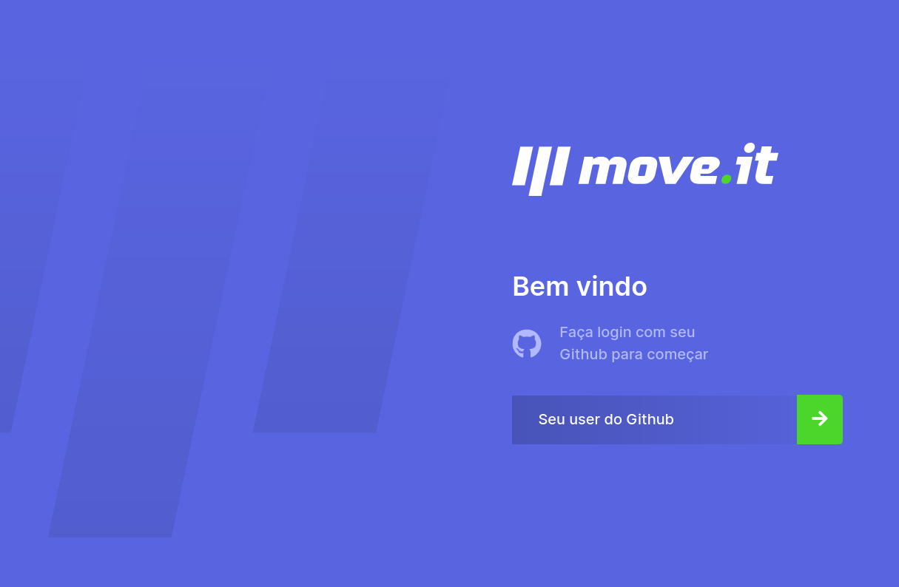
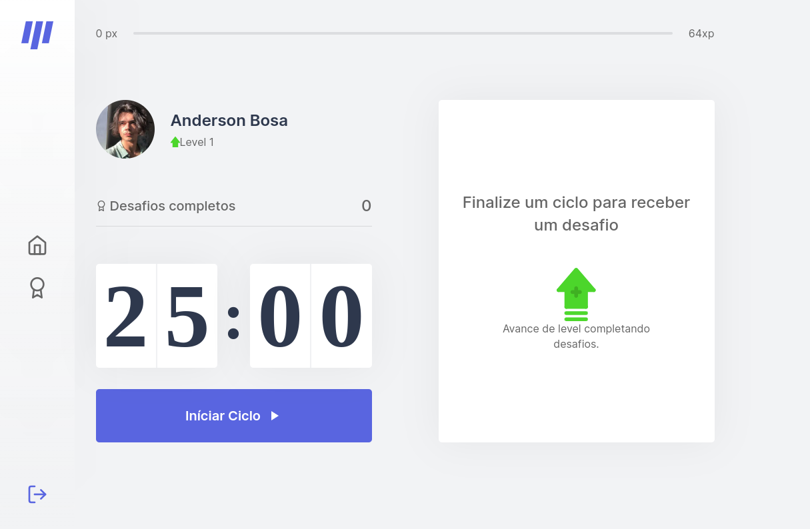
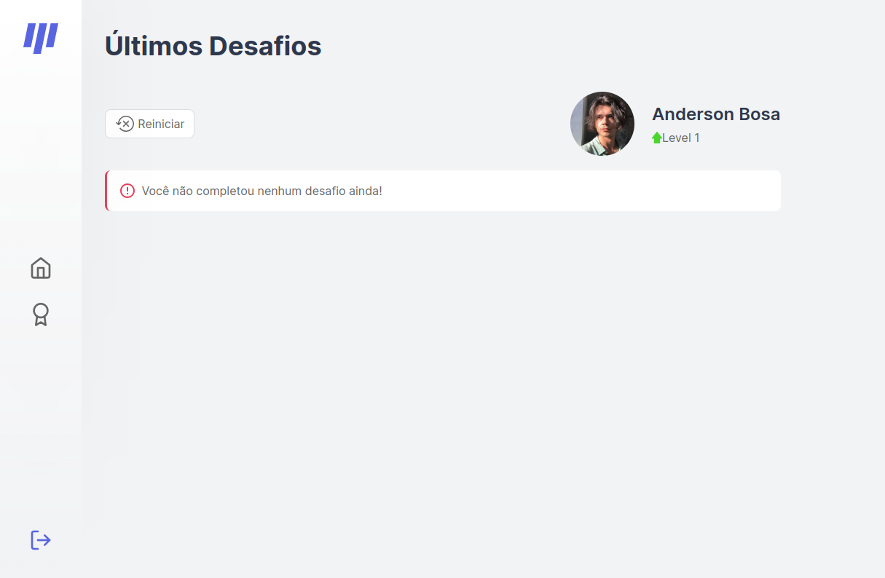

<section align="center">

  

   
   

  <!-- badges -->

  

    <a href="#about">About</a> •
    <a href="#technologies">Technologies</a> •
    <a href="#contribution">Contribution</a> •
    <a href="#license">License</a> •
    <a href="#demo">Demo ⭐</a>
  

</section>

---
<h2 id="about">💬 About</h2>

Application of memories record developed at NLW 4 offered by [Rocketseat](https://rocketseat.com.br/).

<h2 id="technologies"> 🛠️ Technologies</h2>

- [Next.js](#)
- [React](#)
- [JS Cookie](#)
- [Framer Motion](#)
- [Eslint](#)

<h2 id="contribution">🤝 Contribution</h2>

  This project is for study purposes too, so please send me a message telling me what you are doing and why you are doing it, teach me what you know. All kinds of contributions are very welcome and appreciated!

<h2 id="license"> 📝 License</h2>

This project is under the MIT license.

<h2 id="Demo"> ⭐ Demo</h2>

You can se a live demo in here: https://nlw4-moveit-andersonbosa.vercel.app/

### Prints

<table align="center">
  <tr>
    <td>
      

        
<strong>Home non-logged</strong>

        
      

    </td>
    <td>
      

        
<strong>Home logged</strong>

        
      

    </td>
  </tr>
</table>
<table>
  <tr>
    <td>
      

        
<strong>Challenges</strong>

        
      

    </td>
  </tr>
</table>

---

<h4>  
  
  | Did you like the repository? Give it a star! 😁
</h4>
